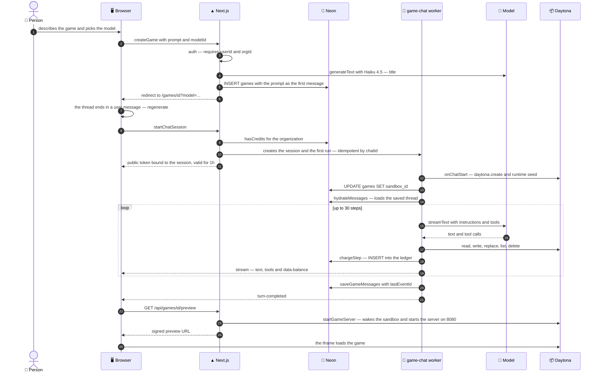
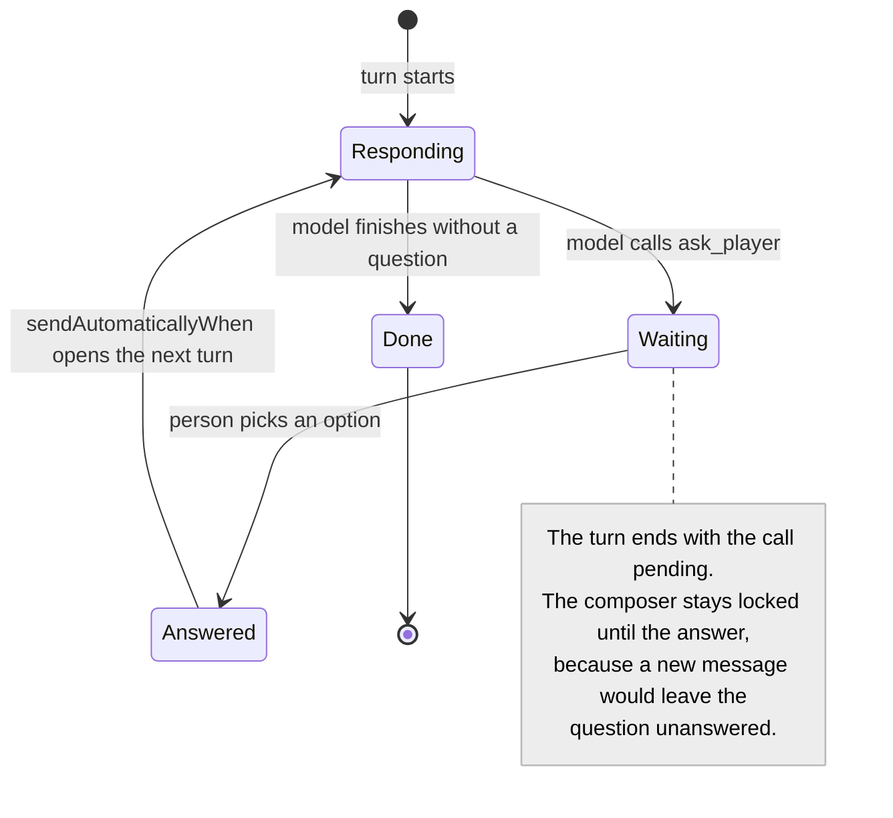
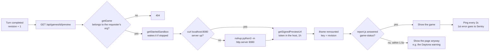
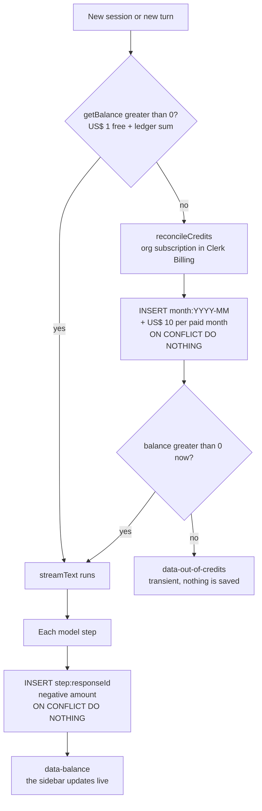
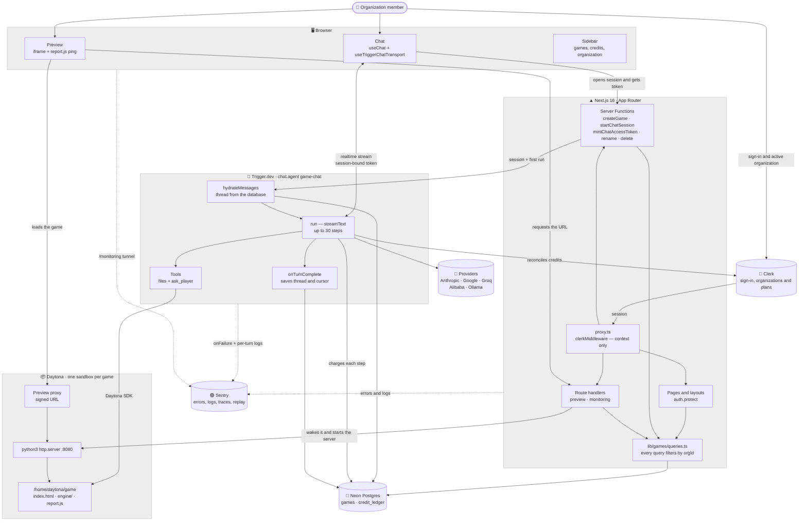

<div align="center">

# Playforge

**Describe a game. Watch it get built. Play it right away.**

Agentic 3D game builder: an AI agent plans the scene, writes the Three.js code inside an isolated
cloud sandbox, and delivers a playable game right next to the chat.

[](https://nextjs.org)
[](https://ai-sdk.dev)
[](https://trigger.dev)
[](https://daytona.io)
[](https://threejs.org)
[](https://neon.com)
[](https://clerk.com)
[](https://sentry.io)

<br/>


</div>

Here, making a game is a conversation. You describe what you want — a racer, a shooter, a puzzle, a
whole world — and an agent takes over: it asks the questions your description left open, writes the
game's files on an isolated computer in the cloud and, after every reply, the preview next to the
chat reloads with the new version. Want a change? Just send another message in the same chat.

Each organization has its own games, its own credits and a subscription plan. Every model step is
billed to the cent — actually, to the billionth of a dollar.

**Shortcuts** · [What it does](#-what-it-does) · [Stack](#️-full-stack) · [Models](#-the-models) ·
[How it works](#️-how-it-works) · [Architecture](#️-architecture) · [Structure](#-project-structure) ·
[**Running locally**](#-running-locally) · [API keys](#-where-to-get-each-key) ·
[Engineering decisions](#-engineering-decisions) · [Limitations](#️-known-limitations)

---

## ✨ What it does

| | |
| --- | --- |
| **Game from text** | A prompt becomes a playable 3D game. The agent writes HTML, CSS and JavaScript on top of a custom engine built on Three.js. |
| **One computer per game** | Every game gets its own Daytona sandbox: its own file system, process and port. Generated code never runs on the app's server. |
| **Questions before building** | With the `ask_player` tool, the agent asks — as multiple choice — whatever the description left open: loop, goal, controls, world, visuals, feel, sound and challenge. |
| **Durable agent** | The chat runs as a Trigger.dev `chat.agent`, decoupled from the HTTP request. Closing the tab doesn't kill the reply; reloading the page resumes the stream where it left off. |
| **Five models to choose from** | Opus 5, Gemini 3.8 Flash, GPT-OSS 120B (Groq), Qwen 3.8 Max and Qwen3 8B running locally on Ollama. The model is chosen per message. |
| **Live preview** | The game runs in an `iframe` served by its own sandbox. It reloads after every completed turn, and the game's first error goes straight to Sentry. |
| **Credits metered per step** | An append-only ledger charges each model step at the provider's list price, separating fresh tokens, cache reads and cache writes. |
| **SaaS foundation included** | Clerk Organizations and Billing: US$ 1 of free credit per organization and US$ 10 per paid month, with credits rolling over from one month to the next. |
| **Real multi-tenancy** | Every query is filtered by the active organization. The worker, which runs without a session, only acts on games whose access was already checked on the server. |
| **End-to-end observability** | Sentry in the browser, on the server, at the edge and inside the task worker, with structured logs per turn, per tool and per sandbox. |

---

## 🛠️ Full stack

| Layer | Technology |
| --- | --- |
| **Framework** | Next.js `16.2.6` (App Router, Turbopack), React `19.2.4`, TypeScript `^5` |
| **AI agent** | AI SDK `ai` `^7.0.97` — `streamText`, Zod-typed tools, `useChat` |
| **Durable agent** | Trigger.dev `4.5.16` — `chat.agent`, sessions and realtime · `node-24` runtime |
| **Model providers** | `@ai-sdk/anthropic` · `@ai-sdk/google` · `@ai-sdk/groq` · `@ai-sdk/alibaba` · `ollama-ai-provider-v2` |
| **Sandboxes** | Daytona `@daytona/sdk` `^0.211.2` — one sandbox per game, preview via signed URL |
| **Game runtime** | Three.js `0.186.0` via import map (jsDelivr) + custom engine in `lib/games/runtime/engine` |
| **Database** | Neon Postgres (HTTP driver `@neondatabase/serverless` `^1.1.0`) + Drizzle ORM `^0.45.2` |
| **Auth** | Clerk `^7.9.1` — Organizations, `OrganizationSwitcher`, `auth.protect()` |
| **Billing** | Clerk Billing — per-organization `PricingTable`, reconciled with the ledger |
| **Error tracking** | Sentry `^10.74.0` — `@sentry/nextjs` in the app, `@sentry/node` in the worker, source maps on both sides |
| **Styling / UI** | Tailwind CSS `^4`, shadcn/ui `^4.21.0` (`base-nova` style on Base UI `^1.8.0`), `lucide-react` |
| **Validation** | Zod `^4.6.2` — tool input, chat `clientData`, output schemas |

> In Next.js 16, *Middleware* became **Proxy** — hence the `proxy.ts` at the root instead of
> `middleware.ts`. It runs `clerkMiddleware()` and nothing else.

> Neon comes with two connection strings: `DATABASE_URL` (pooled, via PgBouncer) for the
> application and `DATABASE_URL_UNPOOLED` (direct) for `drizzle-kit`. PgBouncer runs in transaction
> mode and can't handle the session-level operations `drizzle-kit` uses.

> **The schema is synced, not migrated.** The project is in development and has no compatibility
> commitments, so changes to `lib/db/schema.ts` are applied with `npm run db:push`. There is no
> `drizzle/` folder and no `drizzle-kit migrate` — and there shouldn't be.

---

## 🤖 The models

The catalog lives in two files on purpose: `lib/ai/model-catalog.ts` (ids, names and taglines,
**client-safe**, read by the model picker) and `lib/ai/models.ts` (each provider's instance,
**server-only**). The `satisfies Record<GameModelId, …>` on both sides — and in the pricing table —
turns a forgotten model into a compile error.

| Model | id | Provider | Key | US$ / 1M tokens (input · output) | Best for |
| --- | --- | --- | --- | --- | --- |
| **Opus 5** ⭐ | `claude-opus-5` | Anthropic | `ANTHROPIC_API_KEY` | 5 · 25 | Games from scratch — the default |
| **Gemini 3.8 Flash** | `gemini-3.8-flash` | Google | `GOOGLE_GENERATIVE_AI_API_KEY` | 0.75 · 3.75 | Everyday changes |
| **GPT-OSS 120B** | `openai/gpt-oss-120b` | Groq | `GROQ_API_KEY` | 0.15 · 0.60 | Small tweaks, fastest response |
| **Qwen 3.8 Max** | `qwen3.8-max` | Alibaba Model Studio | `DASHSCOPE_API_KEY` | 2 · 6 | Full builder |
| **Qwen3 8B (local)** | `qwen3:8b` | Ollama | — | free | Small tweaks, private |
| *Claude Haiku 4.5* | `claude-haiku-4-5` | Anthropic | `ANTHROPIC_API_KEY` | — | Only generates the game title |

> ⭐ **`ANTHROPIC_API_KEY` is required** even if you only use other models: every new game's title is
> generated by Haiku, inside `createGame`.

Prices live in `lib/credits/pricing.ts`, including each provider's cache read and cache write price,
and were checked on 2026-09-13. Gemini is on promotional pricing until 2026-12-31 and doubles on
2027-01-01.

### The agent's tools

| Tool | What it does | Detail |
| --- | --- | --- |
| `write_file` | Creates or overwrites a file | Always receives the **full** content; folders are created as needed |
| `replace_text` | Replaces an exact snippet | The snippet must appear **exactly once**, unless `replaceAll` is `true` |
| `read_file` | Reads a whole file | The agent is instructed to read before editing |
| `list_files` | Lists the game folder | Recursive, up to 10 levels |
| `delete_file` | Deletes a file or folder | Recursive |
| `ask_player` | Multiple-choice question | 2 to 4 options, about one of 8 game dimensions. **Has no `execute`**: the person answers it |

Every path is resolved against `/home/daytona/game` and rejected if it escapes it — `../.bashrc` and
`/etc/passwd` stop at `resolveGamePath`.

---

## ⚙️ How it works

### The path of a new game



The browser talks to Trigger.dev **directly**, through `useTriggerChatTransport`. Next.js does only
two things in the chat: it opens the session (`startChatSession`) and issues tokens
(`mintChatAccessToken`), always after checking that the game belongs to the requester's organization.

### One game = one chat = one sandbox

The chat id **is** the game id. The `games.messages` column is the source of truth for the
conversation: `hydrateMessages` loads the thread from the database every turn, and the client sends
only the new message — or none, when it wants a reply to the thread that's already saved, as with the
first prompt.

| What | Where it lives | Who writes it |
| --- | --- | --- |
| Conversation | `games.messages` (jsonb, AI SDK `UIMessage` format) | the worker, before the model starts and at the end of each turn |
| Stream cursor | `games.last_event_id` | the worker, in the **same UPDATE** as the conversation |
| Game files | `/home/daytona/game` in the sandbox | the agent's tools |
| Sandbox | `games.sandbox_id` + `gameId` label in Daytona | `onChatStart` |
| Credits | `credit_ledger` | per-step charges and monthly grants |

### Asking the player (human-in-the-loop)



Since `ask_player` has no `execute`, calling the tool **ends the turn** with the call in
`input-available`. The answer comes back as a trimmed-down copy of the assistant message, and
`applyAnswers` fits it into the saved reply **by `toolCallId`** — the copy doesn't always keep the
original message id. The answer is saved before the model speaks again, so a reload midway doesn't
ask the question again.

### Reloading mid-reply

The `lastEventId` saved with the conversation becomes `initialSession` on the game page, and
`useChat` starts with `resume: true`. Two `TransformStream`s keep the stream consistent:

- **`fromTurnStart`** drops whatever a new turn repeats from the previous one. After a *stop*, the
  transport resumes from the last chunk it read and resends the rest of that turn: deltas for parts
  this stream never opened, which `useChat` would reject (`Received tool-input-delta for missing tool
  call`). `data-*` parts and errors always pass through.
- **`withSavedReply`** puts the saved parts back in front of the resumed ones when the reply in
  progress continues the last saved one. Without it, the answered question flickers and disappears.

### The preview



- **The URL is signed** because the token has to be in the URL itself: an `iframe` doesn't send
  headers. The token goes in the host, so the origin is stripped from the stack before the error is
  logged.
- **The `iframe` is remounted every turn** (`key={revision}`). Daytona may return the same URL after
  an update, and an unchanged `src` reloads nothing.
- **The page only shows once the game responds.** `report.js` (the first script in every game's
  `<head>`) answers each `game-ping` with a `game-status`. Until that happens, the `iframe` is covered
  by a `#262624` background — so Daytona's unstyled "Redirecting…" page never flashes white.
- **The game's first error goes to Sentry**, with the full stack. `report.js` catches script and
  resource-loading errors (capture phase), `unhandledrejection` and the errors the engine itself
  catches via `window.recordGameError`.

### Credits



- **The balance is the ledger sum** plus US$ 1 that isn't a row — an organization with no rows at all
  reads exactly US$ 1.00.
- **The unit is a billionth of a dollar** (`DOLLAR = 1_000_000_000`). A cheap step costs a fraction
  of a cent, and the sum has to come out exact. `bigint` in `number` mode is exact up to 2^53, about
  US$ 9 million.
- **Every write is idempotent.** The unique key `(org_id, entry_key)` ensures the same step
  (`step:<responseId>`) is never charged twice and the same month (`month:2026-09`) is never granted
  twice.
- **Reconciliation is lazy.** It only queries Clerk when the balance hits zero and when someone opens
  `/billing`. A zero balance may just mean a paid month has renewed since the last sync.
- **A reply in progress can end below zero.** The block applies to the next turn, and a charge that
  fails is reported to Sentry without cutting the reply short.

---

## 🏗️ Architecture

### Overview



### System map

Who is responsible for what, from top to bottom:

```mermaid
%%{init: {'themeVariables': {'clusterBkg': 'rgba(127,127,127,0.14)', 'clusterBorder': 'rgba(127,127,127,0.50)', 'noteBkgColor': 'rgba(127,127,127,0.14)', 'noteBorderColor': 'rgba(127,127,127,0.50)', 'labelBoxBkgColor': 'rgba(127,127,127,0.14)', 'labelBoxBorderColor': 'rgba(127,127,127,0.50)'}}}%%
flowchart TD
    Root["🎮 Playforge"]

    Root --> Web["▲ Next.js app<br/>app/ · components/"]
    Root --> Dom["🧠 Shared domain<br/>lib/"]
    Root --> Wk["🔵 Trigger.dev worker<br/>trigger/"]
    Root --> Rt["🕹️ Game runtime<br/>lib/games/runtime/"]
    Root --> Cfg["⚙️ Configuration<br/>repository root"]

    Web --> W1["Protected routes<br/>app/(app): home, games/id, billing"]
    Web --> W2["Public routes<br/>sign-in · sign-up"]
    Web --> W3["Route handlers<br/>api/games/id/preview · monitoring"]
    Web --> W4["Chat and preview<br/>chat-thread · chat-preview · game-chat"]
    Web --> W5["Design system<br/>components/ui — shadcn base-nova"]

    Dom --> D1["lib/ai<br/>catalog, models, agent"]
    Dom --> D2["lib/games<br/>actions, queries, tools, instructions"]
    Dom --> D3["lib/credits<br/>ledger, pricing, reconcile"]
    Dom --> D4["lib/daytona<br/>sandbox lifecycle"]
    Dom --> D5["lib/db<br/>schema and Drizzle client"]

    Wk --> K1["chat.ts<br/>the game-chat agent"]
    Wk --> K2["init.ts<br/>worker Sentry setup"]
    Wk --> K3["example.ts · sentry-test.ts<br/>support tasks"]

    Rt --> R1["index.html + style.css<br/>welcome page"]
    Rt --> R2["engine/<br/>core, input, hud, audio, physics,<br/>particles, camera, models, world, effects"]
    Rt --> R3["report.js<br/>error bridge to the app"]

    Cfg --> C1["trigger.config.ts · next.config.ts"]
    Cfg --> C2["drizzle.config.ts · neon.ts"]
    Cfg --> C3["proxy.ts · instrumentation*.ts · sentry.*.config.ts"]
```



### Where each piece of code runs

This is what trips up most people new to the project: **the same `lib/` runs in two different
processes**, and only one of them is Next.js.

| Process | What runs there | Consequence |
| --- | --- | --- |
| **Next.js server** | pages, Server Functions, route handlers, `lib/*` | has Clerk's `auth()`; uses `@sentry/nextjs` |
| **Trigger.dev worker** | `trigger/chat.ts` and the `lib/*` it imports (tools, credits, Daytona, database) | **has no request and no `auth()`**. Uses `@sentry/node` and `@clerk/backend`, and finds the organization from the game row |
| **App browser** | `"use client"` components, `useChat`, the Trigger.dev transport | only receives scoped tokens and generic error messages |
| **Daytona sandbox** | the game files and an `http.server` | runs model-generated code — isolated from the app |
| **Preview `iframe`** | the game, on another origin | talks to the app only through `postMessage`, with the origin checked |

That's why the shared `lib/` imports `@sentry/node` (the Next.js SDK is built on top of it and shares
the same client), and why `trigger.config.ts` uses the `react-server` condition: modules that import
`server-only` resolve to the empty version inside the worker.

### Multi-tenancy and authentication

**Authentication lives on the resource, not in the proxy.** `proxy.ts` runs `clerkMiddleware()` and
nothing else. Server Functions are called by **id**, not by route, so a path-based lock in the
middleware wouldn't protect them.

| Surface | How it's protected | Response to unauthorized callers |
| --- | --- | --- |
| Pages | `auth.protect()` | redirects to `/sign-in` |
| `createGame` · `renameGame` · `deleteGame` | require `userId` and `orgId`, and `getGame` checks ownership | error |
| `startChatSession` · `mintChatAccessToken` | `assertCanChat` — the chatId comes from the browser | error, logged as `Chat access denied` |
| `GET /api/games/[id]/preview` | `getGame` scoped to the organization | `404` |
| Queries | `getGame` / `listGames` always filter by `orgId` and validate the UUID before hitting the database | `null` / `[]` |
| Worker | only acts on a `chatId` whose session was opened by a Server Function that checked access | — |

The token the browser gets from Trigger.dev is **scoped to that game's session** (`read` and `write`
on `sessions: chatId`) and expires in 1 hour; the transport requests a new one on its own.

### Observability

| Where | How it reaches Sentry |
| --- | --- |
| Browser | `instrumentation-client.ts` — traces (100% in dev, 10% in production), Session Replay (10%, 100% on error), tunnel at `/monitoring` |
| Server / Edge | `instrumentation.ts` + `onRequestError`, with `includeLocalVariables` |
| Worker | `trigger/init.ts` — global `tasks.onFailure` after retries, and `onStartAttempt` tagging every log with the task and the run |
| Chat turn | `onTurnComplete` — one log per turn with the model, tokens, tools, tool errors and whether it stopped to wait for the player |
| Game | the first error of each revision, with the game's stack minus the URL token |
| Source maps | `withSentryConfig` in `next.config.ts` (app) and `sentryEsbuildPlugin` in `trigger.config.ts` (worker, deploy only) |

The `/monitoring` tunnel is a **custom route**, not the SDK's `tunnelRoute`: the rewrite would
forward the browser's cookies — including the Clerk session — and Sentry's ingestion rejects large
headers. The route only forwards envelopes for the project's own DSN, so it can't become an open
relay.

---

## 📁 Project structure

| Folder | Responsibility |
| --- | --- |
| **`app/`** | Routes and protects. No business logic lives here. |
| **`components/`** | The interface: chat, preview, sidebar and the design system in `ui/`. |
| **`lib/`** | The domain, shared between Next.js and the worker. |
| **`trigger/`** | The Trigger.dev tasks — the agent and its initialization. |
| **root** | Build, runtime and observability configuration. |

### `app/` — routes

```
app/
├── (app)/
│   ├── layout.tsx                     sidebar + organization credit balance
│   ├── page.tsx                       "What should we build today?" + composer
│   ├── games/[id]/page.tsx            chat + preview; hands over the cursor to resume
│   └── billing/page.tsx               balance, reconciliation and PricingTable
│
├── sign-in/[[...sign-in]]/            Clerk <SignIn />
├── sign-up/[[...sign-up]]/            Clerk <SignUp />
│
├── api/games/[id]/preview/route.ts    wakes the sandbox and returns the signed URL
├── monitoring/route.ts                Sentry tunnel (validates the DSN)
├── global-error.tsx
└── layout.tsx                         ClerkProvider + ThemeProvider + fonts
```

### `components/` — interface

```
components/
├── chat-thread.tsx                    useChat + transport, ask_player, resume
├── chat-composer.tsx                  message field + model picker
├── chat-preview.tsx                   iframe, cover and error ping
├── game-chat.tsx                      resizable panels thread | preview
├── new-game-composer.tsx              first prompt and suggestions
├── model-picker.tsx                   reads the model-catalog (client-safe)
├── credit-balance.tsx                 balance context, updated by the stream
├── app-sidebar.tsx                    games, credits, OrganizationSwitcher
├── game-header.tsx · game-actions-menu.tsx
├── theme-provider.tsx                 next-themes + "d" shortcut
└── ui/                                shadcn/ui (base-nova)
```

### `lib/` — domain

```
lib/
├── ai/
│   ├── model-catalog.ts               ids and names — no provider imports
│   ├── models.ts                      id → provider instance (server-only)
│   └── agent.ts                       model + instructions + 30-step limit
│
├── games/
│   ├── actions.ts                     Server Functions: create, session, token, rename, delete
│   ├── queries.ts                     organization-scoped reads
│   ├── messages.ts                    worker reads and writes (no auth)
│   ├── tools.ts                       file tools, bound to one game
│   ├── ask-player.ts                  the question to the player (no execute)
│   ├── instructions/                  system prompt: workflow · runtime · engine · design
│   ├── runtime/                  ◄──  the files every new game receives
│   ├── seed.ts                        copies runtime/ into the sandbox
│   ├── suggestions.ts · title.ts
│
├── credits/
│   ├── ledger.ts                      balance and per-step charging
│   ├── pricing.ts                     price per model and cost of a step
│   ├── reconcile.ts                   Clerk Billing → monthly grants
│   └── format.ts                      DOLLAR and formatting
│
├── daytona/
│   ├── client.ts                      new Daytona() — reads DAYTONA_API_KEY
│   └── utils.ts                       create, wake, delete, start the server
│
└── db/
    ├── schema.ts                      games + credit_ledger
    └── index.ts                       Drizzle over the Neon HTTP driver
```

### Root — configuration

```
proxy.ts                               clerkMiddleware() and nothing else
trigger.config.ts                      node-24, Daytona external, runtime/ copied, source maps
next.config.ts                         withSentryConfig
drizzle.config.ts                      points to DATABASE_URL_UNPOOLED
neon.ts                                branch policy (7-day TTL)
instrumentation.ts                     Sentry on the server and at the edge
instrumentation-client.ts              Sentry in the browser
sentry.server.config.ts · sentry.edge.config.ts
AGENTS.md · CLAUDE.md                  rules for coding agents in this repo
```

---

## 🚀 Running locally

### Summary

```bash
git clone https://github.com/renatomf/nextjs-sandbox.git
cd nextjs-sandbox
npm install

# create .env.local (template below) and change the project in trigger.config.ts

npm run db:push        # creates the tables in Neon
npm run dev            # terminal 1 → http://localhost:3000
npm run trigger:dev    # terminal 2 → agent worker
```

There are **two processes**. Without `trigger:dev` running, the app opens and the game gets created,
but the chat never replies — the worker is what replies.

### Prerequisites

| Item | Version / note |
| --- | --- |
| **Node.js** | 24 (the worker runs on `node-24`; tested with `v24.20.0`) |
| **npm** | 11 |
| **Accounts** | Clerk, Neon, Trigger.dev, Daytona and Anthropic — required |
| **Optional** | Google AI Studio, Groq, Alibaba Model Studio, Sentry, [Ollama](https://ollama.com) |

### 1. Environment variables

Create a `.env.local` at the root. It's read by Next.js, by `drizzle-kit` (via `@next/env`) and by
the worker in dev.

```bash
# ─── Clerk ─────────────────────────────────────────────────────────────
NEXT_PUBLIC_CLERK_PUBLISHABLE_KEY=...
CLERK_SECRET_KEY=...
NEXT_PUBLIC_CLERK_SIGN_IN_URL=/sign-in
NEXT_PUBLIC_CLERK_SIGN_UP_URL=/sign-up
NEXT_PUBLIC_CLERK_SIGN_IN_FALLBACK_REDIRECT_URL=/
NEXT_PUBLIC_CLERK_SIGN_UP_FALLBACK_REDIRECT_URL=/

# ─── Neon ──────────────────────────────────────────────────────────────
DATABASE_URL=
DATABASE_URL_UNPOOLED=...
NEON_BRANCH=                     # written by the Neon CLI; optional

# ─── Trigger.dev ───────────────────────────────────────────────────────
TRIGGER_SECRET_KEY=...

# ─── Daytona ───────────────────────────────────────────────────────────
DAYTONA_API_KEY=...

# ─── Models ────────────────────────────────────────────────────────────
ANTHROPIC_API_KEY=sk-ant-...     # required (Opus 5 + titles)
GOOGLE_GENERATIVE_AI_API_KEY=    # Gemini 3.8 Flash
GROQ_API_KEY=                    # GPT-OSS 120B
DASHSCOPE_API_KEY=               # Qwen 3.8 Max

# ─── Sentry (optional) ─────────────────────────────────────────────────
SENTRY_DSN=
NEXT_PUBLIC_SENTRY_DSN=
NEXT_PUBLIC_SENTRY_ENVIRONMENT=development
SENTRY_ORG=
SENTRY_PROJECT=
SENTRY_AUTH_TOKEN=               # only for uploading source maps on build/deploy
```

### 2. Database

```bash
npm run db:push
```

Creates `games` and `credit_ledger` from `lib/db/schema.ts`. Run it again whenever the schema
changes. **Never** `drizzle-kit generate` or `drizzle-kit migrate` — see `AGENTS.md`.

`npm run db:studio` opens Drizzle Studio so you can inspect the data.

### 3. Start both processes

```bash
# terminal 1
npm run dev

# terminal 2
npm run trigger:dev
```

The first time, `trigger:dev` asks you to log in through the browser. It runs the worker **on your
machine** and registers the `game-chat`, `hello-world` and `sentry-error-test` tasks in the project's
**Dev** environment. In dev, the CLI loads the `.env*` files at the root, so the same `.env.local`
works for both processes. If a variable is missing inside the worker, add it under **Environment
Variables → Dev** in the Trigger.dev dashboard.

### 4. First use

1. Open `http://localhost:3000` and create an account.
2. Create (or pick) an **organization** — games, credits and the plan belong to it.
3. Describe a game, pick the model and send. The organization starts with **US$ 1** of credit.
4. Answer the agent's questions. The preview shows up next to the chat once the first turn finishes.

---

## 🔑 Where to get each key

### Clerk — sign-in, organizations and billing

1. Create an application at [dashboard.clerk.com](https://dashboard.clerk.com).
2. **API keys** → copy the *Publishable key* (`pk_test_…`) and the *Secret key* (`sk_test_…`).
3. **Organizations** → enable them. Recommended: **Membership required**, so every session has an
   active organization. The app requires an `orgId` to create games.
4. **Billing** → enable it for **organizations** and create a plan with a monthly fee (the billing
   page presents it as *Builder*). Any plan with a base fee counts as paid: each paid month grants
   US$ 10, and free trial periods don't count. In development, Clerk uses a test payment gateway.
5. The sign-in URLs (`/sign-in`, `/sign-up`) already exist in the app; just fill in the
   `NEXT_PUBLIC_CLERK_*_URL` variables.

### Neon — Postgres

1. Create a project at [console.neon.tech](https://console.neon.tech).
2. **Connection details** → copy the **pooled** string (host with `-pooler`) into `DATABASE_URL` and
   the **direct** one into `DATABASE_URL_UNPOOLED`.
3. Alternative: with the Neon CLI, `neon env pull` writes both into `.env.local`, and
   `neon checkout <name>` creates a branch with a 7-day TTL (policy in `neon.ts`).

### Trigger.dev — the agent worker

1. Create a project at [cloud.trigger.dev](https://cloud.trigger.dev).
2. Copy the *Project ref* (`proj_…`) into `trigger.config.ts`.
3. **API keys** → **Dev** environment → copy the *Secret key* (`tr_dev_…`) into `TRIGGER_SECRET_KEY`.
   In production, use the **Prod** environment key (`tr_prod_…`).

### Daytona — the sandboxes

1. Create an account at [app.daytona.io](https://app.daytona.io).
2. **Dashboard → API Keys** → create a key with permission to create, list and delete sandboxes.
3. Paste it into `DAYTONA_API_KEY`. The SDK reads the variable on its own (`new Daytona()`).

Resource limits and the preview warning depend on your organization's *tier* in Daytona (see
**Limits** in the dashboard). Each game uses a sandbox with the default configuration, and idle
sandboxes stop on their own.

### Model providers

| Provider | Where | Variable |
| --- | --- | --- |
| Anthropic | [console.anthropic.com](https://console.anthropic.com) → API Keys | `ANTHROPIC_API_KEY` |
| Google | [aistudio.google.com](https://aistudio.google.com) → Get API key | `GOOGLE_GENERATIVE_AI_API_KEY` |
| Groq | [console.groq.com](https://console.groq.com) → API Keys | `GROQ_API_KEY` |
| Alibaba Model Studio | Model Studio console (DashScope, international region) → API Key | `DASHSCOPE_API_KEY` |
| Ollama | local, no key: `ollama pull qwen3:8b` | — |

The Alibaba provider reads `ALIBABA_API_KEY` by default. `lib/ai/models.ts` creates it with
`DASHSCOPE_API_KEY` on purpose.

### Sentry — optional, but recommended

1. Create a **Next.js** project at [sentry.io](https://sentry.io).
2. Copy the DSN into `SENTRY_DSN` and `NEXT_PUBLIC_SENTRY_DSN`.
3. For source maps: `SENTRY_ORG`, `SENTRY_PROJECT` and an *Auth token* with the releases scope in
   `SENTRY_AUTH_TOKEN`. Without the token, the build still succeeds — it just doesn't upload the
   maps.
4. To test the worker: run the `sentry-error-test` task on the **Test** page of the Trigger.dev
   dashboard. It fails on purpose.

---

### Scripts

| Script | What it does |
| --- | --- |
| `dev` · `build` · `start` | The Next.js cycle |
| `lint` · `typecheck` · `format` | ESLint · `tsc --noEmit` · Prettier (with the Tailwind plugin) |
| `db:push` · `db:studio` | Drizzle Kit — syncs the schema · opens Studio |
| `trigger:dev` · `trigger:deploy` | Local worker · deploys the worker |

---

## 🧠 Engineering decisions

**The worker shares `lib/` with Next.js.** Tools, credits and Daytona access are written only once.
The price: `lib/` can't depend on anything that only exists in Next — hence `@sentry/node` instead
of `@sentry/nextjs`, `@clerk/backend` instead of `auth()`, and the `react-server` condition in the
worker build.

**The Daytona SDK stays out of the bundle.** It loads `form-data` (upload) and `busboy` (download)
through its own `require` alias, which esbuild can't see. Bundled, it can't find those two
dependencies after deploy. As an `external`, it gets installed along with them.

**The game runtime is copied into the build, not imported.** The files in `lib/games/runtime` are
read with `fs` when the sandbox is created; nothing imports them, so the bundle would leave them out.
`additionalFiles` copies them, and `legacyDevProcessCwdBehaviour: false` makes `process.cwd()` point
to the same place in dev and in production.

**The database is the source of truth for the conversation, not the client.** The client sends only
the new message; the worker loads the whole thread every turn. A stale tab can't overwrite the
conversation with an outdated version.

**The conversation and the cursor are written in the same UPDATE.** A reload never sees the new
thread with the previous turn's cursor — which would make the stream replay a turn that's already
saved.

**The cursor is saved even when a turn fails.** That way a reload resumes after it instead of
repeating the error.

**Empty replies are dropped from the thread.** A turn that fails before the model writes anything
(an overloaded provider, for example) still produces an assistant message with no content.
`withoutEmptyReplies` removes it, so the thread still ends on the unanswered message.

**The real error goes to Sentry, and the browser gets `An error occurred.`** Provider messages can
carry a key, an internal URL or a stack trace.

**The model choice travels in the URL and is checked at every step.** The redirect's `?model=` goes
through `isGameModelId`, and each message's `clientData` goes through a `z.enum(GAME_MODEL_IDS)`.
Nothing coming from the browser can pick a model outside the catalog.

**A tool error goes back to the model, not to Sentry as an error.** The model almost always works
around it on its own: it rereads the file, widens the snippet, fixes the path. The failure becomes a
`warn` with the tool, the path and the message — enough to explain a turn that went wrong.

**`replace_text` uses `split`/`join`, not `String.replace`.** `replace` would interpret `$&` and `$1`
inside the new code as replacement patterns — and JavaScript code full of template strings has
plenty of `$`.

**`ask_player` lives outside `tools.ts`.** The file tools are `server-only`; the question needs its
types shared with the UI (`InferUITool<typeof askPlayer>`).

**Deleting a game starts with the database row.** Then come: closing the session (so no new message
opens another run), cancelling the current run (which would keep building — and charging for — a game
that no longer exists) and deleting the sandboxes by the `gameId` label. In the reverse order, a turn
in progress could create a new sandbox for the game. And if a sandbox is created after the row is
gone, `createGameSandbox` itself deletes it: no sandbox outlives its game.

**Sandboxes are woken on demand.** When idle, they stop on their own. The preview route and each
turn's first tool call wake them, and the game server is restarted if the sandbox has restarted. If
the sandbox has been deleted, a new one is created from the runtime — and the old files are lost,
which gets recorded in Sentry.

**Every ledger write is idempotent.** The `(org_id, entry_key)` key makes it safe to repeat a charge
(a Trigger.dev retry) and to reconcile as many times as needed.

**Month math is done in UTC.** `date-fns`'s `addMonths` uses the server's time zone and pushes month
boundaries back to the previous day west of UTC. `reconcile.ts` has its own arithmetic, including
the case of the 31st in shorter months.

**Three.js is pinned in two places that move together:** the import map in
`lib/games/runtime/index.html` and the `THREE_VERSION` constant in the agent's instructions. The
engine and the prompt were written for r186.

**The system prompt is split by topic.** There are four system messages — workflow, runtime, engine
and design — each in its own file, in the order the agent needs them.

